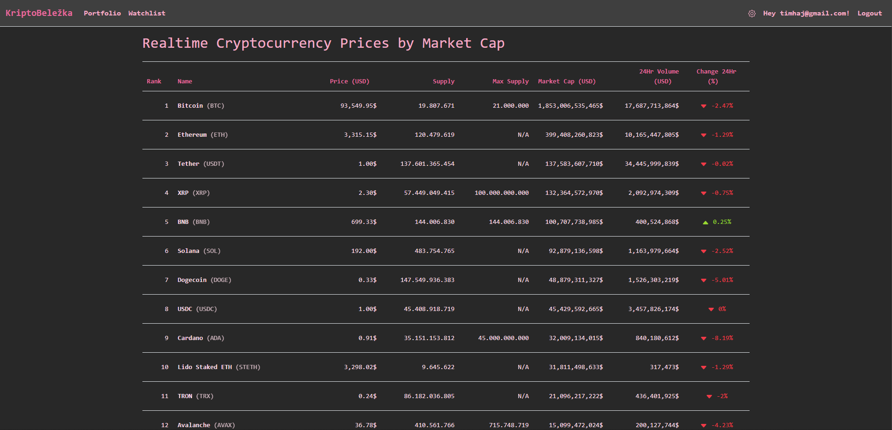
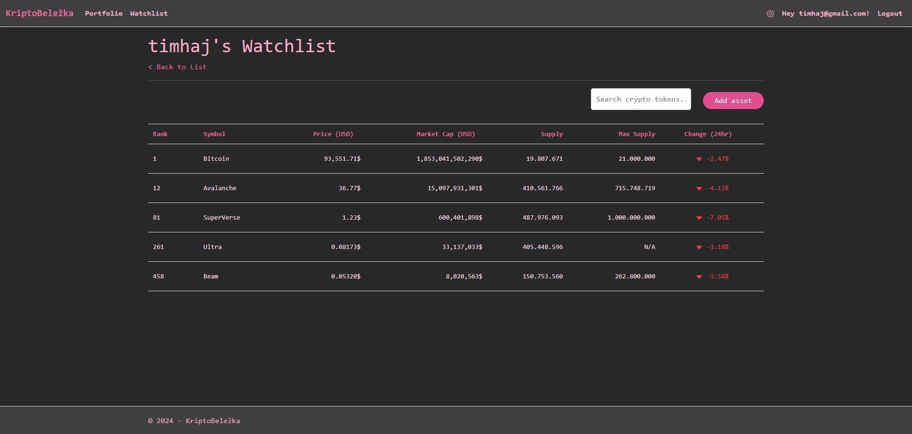
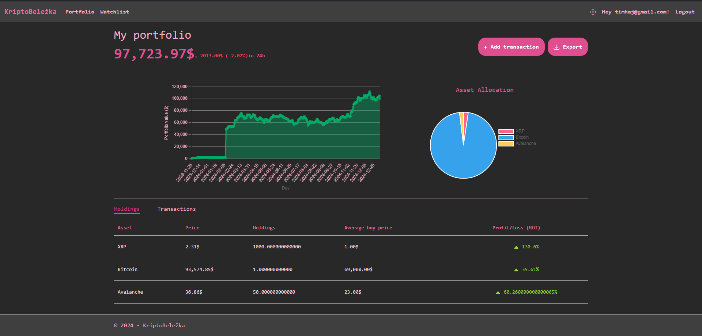
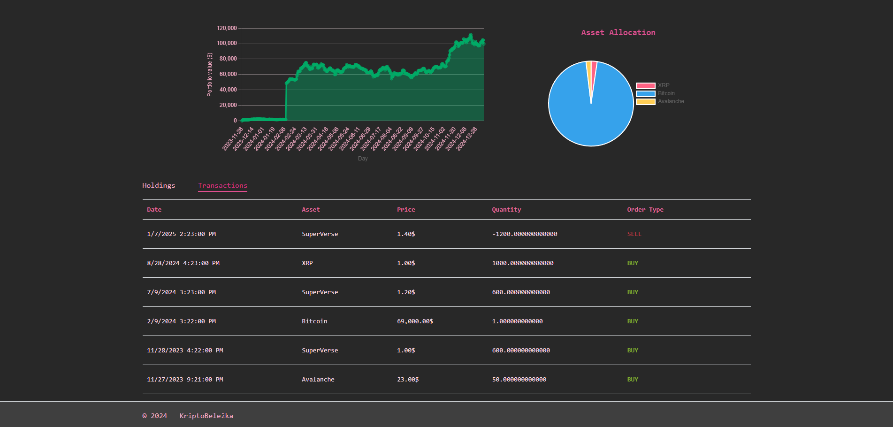
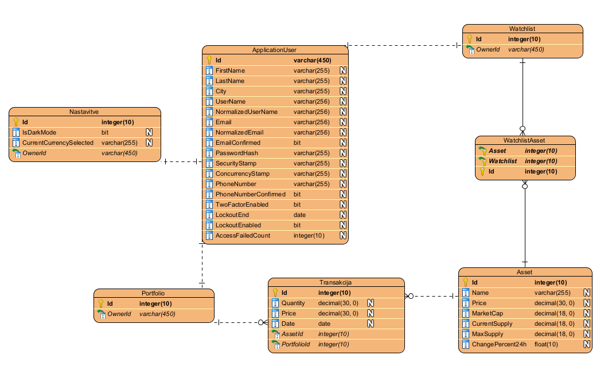

# Naslov seminarske naloge: KriptoBeležka

### Člana ekipe:
- 63230099 Tim Hajdinjak
- 63230244 Žan Petkovšek

### Kratek opis delovanja sistema:
Z informacijskim sistemom KriptoBeležka želimo beležiti transakcije kriptovalut, kar bo uporabnikom omogočalo lažje spremljanje naložb v kateremkoli portfelju. Sistem bo podpiral tudi prilagoditve uporabniških nastavitev, kot so preference glede izgleda aplikacije in izbire valute, v kateri želi uporabnik videti ceno na zaslonu. S transakcijami bomo beležili nakupe in prodaje ter hranili podatke o kupljeni/prodani kriptovaluti, količini in njeni ceni ob nakupu/prodaji. Transakcije so vezane portfelj, pri katerem bo mogoče spremljati zgodovino uspešnosti skozi čas (ali smo v določenem trenutku v plusu ali minusu), prikažejo nam pa tudi trenutno alokacijo sredstev v portfeliju. Uporabnik ima tudi možnost izvoza vseh transakcij v .csv datoteko, ki jo lahko uporablja za kakšno lastno analizo ali pa pri najavi davkov. Dodana bo tudi funkcionalnost, da uporabnik definira svoj lasten sledilnik kriptovalut za prikaz aktivnega dogajanja na trgu.

### Zaslonske slike aplikacije

### Opisi nalog posameznih študentov:
- Tim Hajdinjak
  - Urejal "Portfolio" funkcionalnosti
  - Frontend (UI) aplikacije
  - Postavitev aplikacije na strežnik

- Žan Petkovšek
  - Urejal "Watchlist" funkcionalnosti
  - Postavitev avtorizacije in avtentikacije

- Skupno
  - Postavitev začetne backend strukture
  - Bug fixes
  - Urejanje "Nastavitve" funkcionalnosti
  - Urejanje "Homepage" funkcionalnosti

### Slika podatkovnega modela podatkovne baze

